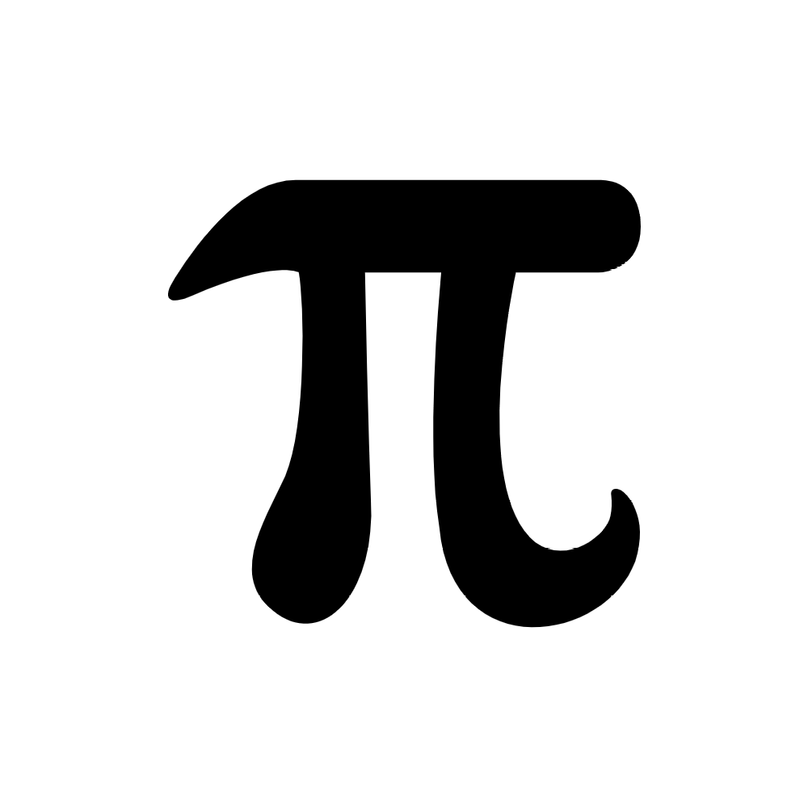

# Complex Fourier Series

Fourier Series is an interesting topic, you can look at the [wiki about this](https://en.wikipedia.org/wiki/Fourier_series)

Complex Fourier Series is essentially the same but we use complex numbers :P

So in this animation more and more "arrows" or "circles" are used to recreate the image below (or rather an svg path of it)

You can try to do the same for other svg images, just clone the repo, install the package and run the [manual_test.py](test/manual_test.py)  
(or you can just copy it into the root folder and don't install anything!)

You'll get the list of the images that you can convert in into moving images in any way you like!  
I made a GIF out of mine ^-^
